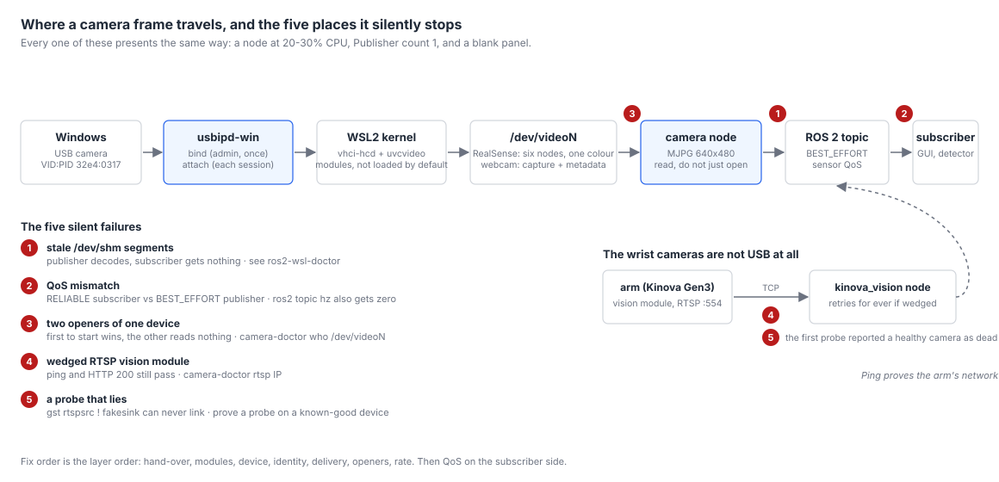
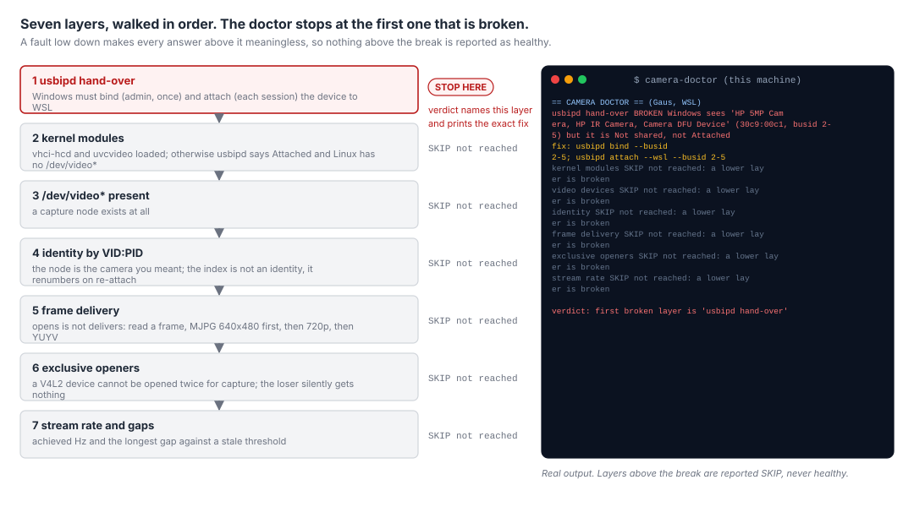
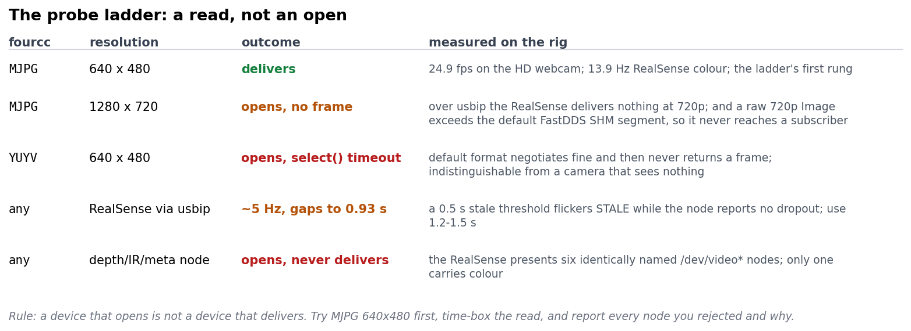
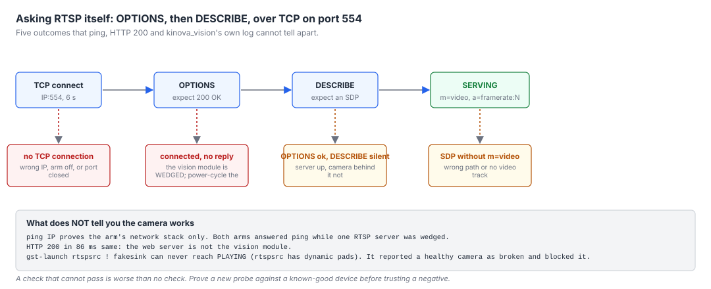

# CamScout


*Live CLI demo: the doctor stops at the first broken layer.*

**Name the first broken layer between a camera and your robot stack, instead of staring at a blank panel.**

Every camera fault on a Linux or WSL2 robot rig presents identically: a node sitting at 20-30 % CPU, a topic that exists with `Publisher count: 1`, and nothing on the screen. Behind that one symptom there are at least seven independent layers that can be wrong, and a fault at layer 2 makes every answer above it meaningless. This tool walks them in order, stops at the first one that is broken, and prints the fix in the operator's words.

```
$ camera-doctor --vidpid 32e4:0317 --exclude 8086:0b3a --rtsp 192.168.1.10 --watch 5
== CAMERA DOCTOR == (lab-laptop, WSL)
  usbipd hand-over    ok           2 camera-like device(s), 2 Attached
  kernel modules      ok           loaded
  video devices       ok           8 node(s): /dev/video0 ... /dev/video7
  identity            ok           32e4:0317 HD USB CAMERA -> video0,video1; 8086:0b3a Intel(R) RealSense(TM) Depth Ca -> video2,...,video7
  frame delivery      ok           /dev/video0 delivers MJPG 640x480 (~24.9 fps)
  exclusive openers   ok           device is free
  stream rate         CANNOT TELL  5.1 Hz, max gap 0.93 s, 3 gap(s) over 0.5 s
                                   fix: raise the consumer's stale threshold above the max gap before calling the camera broken
  rtsp 192.168.1.10   BROKEN       connected to 192.168.1.10:554 and got NO REPLY to OPTIONS: the vision module is wedged. It does not recover on its own; power-cycle the device.

verdict: first broken layer is 'rtsp 192.168.1.10'
```

## The problem

On one weekend of lab time (2026-08-29/30) the single symptom "the camera panel is blank" was produced by five different causes, each of which took hours to tell apart by hand:

1. **Stale DDS shared memory.** After a `kill -9`, FastDDS segments leak; publishers publish, subscribers receive nothing. Seen at 214 stale entries. (That layer lives in the sister tool [`ddsdetective-ros2`](https://github.com/megazron/ddsdetective-ros2).)
2. **QoS mismatch.** Camera topics are BEST_EFFORT. A default RELIABLE subscriber, including a plain `ros2 topic hz`, receives zero and says the topic "does not appear to be published yet". A healthy camera was diagnosed as dead this way.
3. **Two openers of one V4L2 device.** A device cannot be opened twice for capture. The loser gets nothing, silently, and which one loses depends on start order.
4. **A wedged vision module on the arm.** `ping` and HTTP 200 proved the arm's network stack and said nothing about its camera. The RTSP server accepted connections and never replied; the driver retried for ever and published a topic with no frames.
5. **A probe that lies.** The first RTSP check used a GStreamer pipeline that could never link, so it reported "not serving" for healthy cameras and refused to start them.

The rig had four camera feeds over three transports, and it took 40 minutes to work that out because nothing had recorded it: the two wrist cameras are Kinova RTSP servers on the arms themselves, the RealSense D435i presents **six identically named `/dev/video*` nodes** of which exactly one delivers colour, and the HD USB webcam needs MJPG or it opens fine and never delivers a frame. All of it arrives through one `usbipd` hand-over from Windows, whose busids move between sessions.



*Four feeds, three transports, and the five places a camera can be alive and deliver nothing: stale shared memory, a QoS mismatch, two openers of one device, a wedged RTSP server, and a probe that lies.*

## The layers this doctor walks

| # | layer | what it checks | typical fix it prints |
|---|---|---|---|
| 1 | usbipd hand-over (WSL only) | `usbipd list`: is a camera-like device connected to Windows and **Attached**? | `usbipd bind --busid X` (admin, once) then `usbipd attach --wsl --busid X` |
| 2 | kernel modules | `vhci-hcd` and `uvcvideo` are not loaded by default; usbipd says Attached while Linux has no `/dev/video*` | `sudo modprobe vhci-hcd uvcvideo` |
| 3 | identity | every node's USB VID:PID from sysfs, grouped by physical device (RealSense: 6 nodes -> 1 device) | attach the device you actually wanted |
| 4 | frame delivery | a probe that **reads**, walking a format ladder (MJPG 640x480 first) and calling a node good only when a frame arrives | switch to MJPG, drop to 640x480, re-attach |
| 5 | exclusive openers | which process holds the device, from `/proc/*/fd` | make the holder yield when your publisher exists |
| 6 | stream rate | achieved Hz, maximum gap, gaps over your stale threshold | raise the stale threshold above the real gaps |
| 7 | RTSP | OPTIONS then DESCRIBE over TCP; distinguishes refused, wedged, half-alive and serving | power-cycle the device |



*The seven layers in order, and the doctor stopping at the first broken one on this laptop, where the webcam is not yet handed over by usbipd.*

## Install

```bash
# everything, including the OpenCV frame-delivery probe
pip install "camscout-usbip[probe] @ git+https://github.com/megazron/camscout-usbip"

# stdlib only (layers 1-3, 5 and 7; the probe layer reports SKIP with the pip line to add)
pip install git+https://github.com/megazron/camscout-usbip
```

Python 3.10+. Linux and WSL2. No ROS dependency anywhere.

## Quickstart

```bash
camera-doctor                          # walk all layers, plain text
camera-doctor --json                   # same, machine-readable
camera-doctor list                     # Windows devices (usbipd) + Linux devices with identities
camera-doctor attach --vidpid 32e4:0317 --run     # print the usbipd commands, run the attach step, wait for /dev/video*
camera-doctor probe --vidpid 32e4:0317 --exclude 8086:0b3a   # which node actually delivers
camera-doctor who /dev/video0          # which process holds it
camera-doctor watch --index 0 --seconds 10 --stale 1.2       # achieved rate and gaps
camera-doctor rtsp 192.168.1.10 --path /color                # does the arm camera serve
```

Exit code 0 means no reachable layer is BROKEN. `SKIP` means the layer was not reached or needs a dependency; `CANNOT TELL` means the doctor saw something worth a human look but will not call it broken.

## Windows usbipd cheat sheet

* `winget install usbipd` once, in an Administrator PowerShell.
* `usbipd bind --busid X` **needs Administrator**, once per device, survives reboots.
* `usbipd attach --wsl --busid X` needs no admin and is needed after **every reboot and every unplug**.
* **Busids move between sessions.** On the rig 3-2 was the RealSense one day and a Logitech receiver two days later; the RealSense had moved to 3-3. `camera-doctor attach --vidpid ...` looks the device up by identity every time.
* The usbipd Windows service stops on its own on some machines. `Start-Service usbipd` in an admin PowerShell brings it back. When it is down, the cameras **and** the serial devices vanish together, which reads as three unrelated faults.
* `vhci-hcd` and `uvcvideo` are modules and are not loaded by default in the WSL kernel, so usbipd can report Attached while Linux has no `/dev/video*` at all.
* The RealSense over usbip **detached itself once on the first attach of a session** (~26 s in) and then ran for 3+ minutes clean after re-attaching. If it drops, re-attach and carry on.

## Choose a camera by identity, never by index

Detaching and re-attaching renumbers every node: the same two cameras came back as `video1..video8` having been `video0..video7`, so the webcam stopped being index 0 with nothing changing physically. Code that remembers an index fails by silently opening the **wrong** camera, which is far worse than failing to open one.

```python
from usbip_camera_doctor import select_camera

index, tried = select_camera(prefer_vidpid="32e4:0317", exclude_vidpid=("8086:0b3a",))
if index is None:
    for r in tried:
        print(r.index, r.why())      # every node it rejected, and why
```

`exclude_vidpid` matters: a RealSense colour node delivers frames perfectly, so a probe that only asks "does it deliver?" will cheerfully choose it as the room camera and show you a close-up of whatever the depth camera is pointed at.

## A probe is a read, not an open

The default ladder is `MJPG 640x480 -> MJPG 1280x720 -> YUYV 640x480`, in that order, because:

* the RealSense depth and metadata nodes **open cleanly, accept every property and return nothing for ever**;
* many webcams over usbip open fine in YUYV and then `select()` times out, indistinguishable from a camera that sees nothing; MJPG 640x480 on the same device gives 24.9 fps;
* a RealSense delivered at 640x480 over usbip and failed at 1280x720, and a **1280x720 raw ROS `Image` exceeds the default FastDDS shared-memory segment**, so the node captures happily, reports `live: true`, and no subscriber ever receives a frame. 640x480 flows at ~32 Hz.

Pass your own ladder with `--ladder MJPG:640x480,YUYV:320x240`.



*The format and resolution ladder the probe walks, with the outcome each rung produced on the rig.*

## Two openers of one device

When two processes want `/dev/video0`, whichever starts first wins and the other silently gets nothing, so the camera "works sometimes". `camera-doctor who /dev/video0` names the holder without needing `fuser`.

If you write the yielding side, **yield when the other node's publisher exists, never when its frames arrive.** The first fix on the rig yielded on frames and deadlocked: the bridge held the device, so the camera node could not open it, so it never published, so "is it publishing?" stayed false, so the bridge kept the device. A publisher exists the moment a node constructs, before it opens any device, so asking the graph breaks the cycle.

## Known-good numbers from the rig

| feed | transport | rate |
|---|---|---|
| scene camera, RealSense colour | usbip, 640x480 | 13.9 Hz direct; ~5 Hz with gaps up to 0.93 s on a shared hub |
| HD USB webcam | usbip, MJPG 640x480 | 24.9 fps (YUYV: never a frame) |
| each wrist camera | Kinova RTSP, 1280x720 | 30.0 Hz |

A panel with a 0.5 s stale threshold flickered on every RealSense gap while the camera node itself reported no dropout. Both were telling the truth about different things. Measure the gaps (`watch`), then set the threshold.

## ROS 2 notes

* Camera topics are published with `qos_profile_sensor_data` (BEST_EFFORT). A plain `create_subscription(...)` and `ros2 topic hz` are RELIABLE by default and receive **nothing**; DDS logs one `incompatible QoS ... RELIABILITY` warning and goes quiet. Use `ros2 topic hz --qos-reliability best_effort` and subscribe with the sensor-data profile.
* A 720p raw `Image` exceeds the default SHM segment; publish 640x480 or compressed, or raise the segment size.
* The rest of the "publisher fine, nobody receives" family (stale `/dev/shm`, domain splits, a hung `ros2` daemon) is covered by [`ddsdetective-ros2`](https://github.com/megazron/ddsdetective-ros2).

## Python API

```python
from usbip_camera_doctor import (run, parse_usbipd_list, attach_commands,
                                 identity, group_by_device, deliver, select_camera,
                                 RateMeter, rtsp_probe)

results = run(prefer="32e4:0317", exclude=("8086:0b3a",), rtsp_ips=["192.168.1.10"], watch_s=5)
for r in results:
    print(r.name, r.status, r.detail, r.fix)

devs = parse_usbipd_list(open("usbipd_list.txt").read())
print(attach_commands("2-9", "Not shared"))

node = identity(4)            # VideoNode(index=4, name=..., vidpid='8086:0b3a')
print(deliver(4).why())       # "delivers MJPG 640x480 (~13.9 fps)" or why not

r = rtsp_probe("192.168.1.10", "/color")   # RtspResult(ok, status, detail, fps)
```

Every check takes injectable roots (`sysfs_root`, `proc_root`, `proc_modules`, `dev_glob`, `usbipd_text`) so it can be unit-tested without hardware; the test suite runs with no camera and no OpenCV.

## Design rules

* **Walk the layers in order and stop.** Seven independent verdicts are noise; the first wrong layer is the answer.
* **A probe that cannot run must not report zero.** If OpenCV is missing or `usbipd` is unreachable, the layer says SKIP or CANNOT TELL, never BROKEN.
* **A check that cannot pass is worse than no check.** Prove a new probe against a known-good device before trusting its negative.
* **Identity over index.** Nothing remembers `/dev/videoN`.



*What the RTSP probe can tell apart by speaking the protocol, against what ping and HTTP 200 cannot.*

## Figures

Every figure in `docs/img/` is regenerated by `python3 docs/make_figures.py`; the layer panel is captured from a real run.

## License

MIT, Gaus Mohiuddin Sayyad, 2026.
